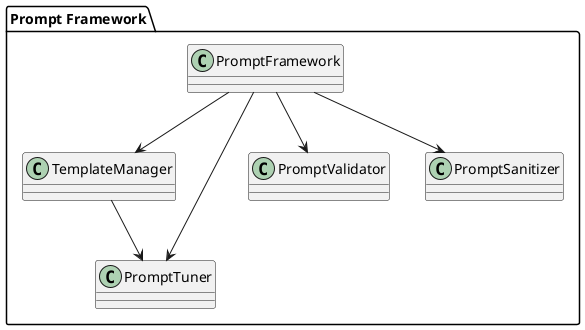
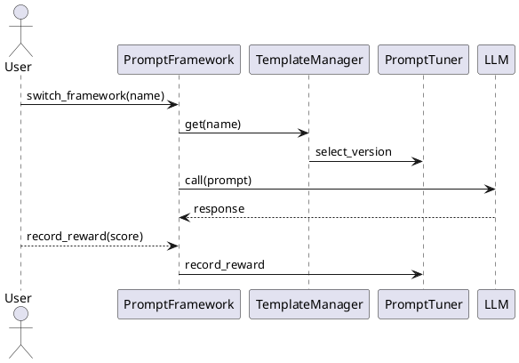

# Prompt Framework V2

**Prompt Framework V2** is a production-grade Python module providing:

- **12+ Built-In Prompt Engineering Frameworks**  
  CoSTAR, CARE, RACE, APE, CREATE, TAG, CREO, RISE, PAIN, COAST, ROSES, REACT
- **Custom Framework Registration** at runtime
- **Reinforcement-Learning Tuning** with an ε-greedy bandit
- **Shot Modes**: zero-shot, single-shot, few-shot via `ShotMode` enum
- **Prompt Chaining** across multiple frameworks
- **Chain-of-Thought**, **Self-Ask**, **Tree-of-Thought** toggles
- **RAG Integration** hook for document retrieval
- **Validation** (length/placeholder) and **Sanitization** (PII redaction)
- **Logging & Telemetry** for observability

---

## 📦 Installation

```bash
pip install prompt-framework-v2
```

Or clone and install:

```bash
git clone https://github.com/yourorg/prompt-framework-v2.git
cd prompt-framework-v2
pip install -r requirements.txt
```

---

## 🔍 Component Breakdown

### 1. `PromptFramework`
- **Role:** Primary interface for users
- **Key Methods:**
  - `switch_framework(name, version=None)`: Selects framework template
  - `generate_prompt(params_model)`: Builds a sanitized, validated prompt
  - `record_reward(score)`: Feeds back user rating for tuning
  - `chain_frameworks(sequence)`: Generates multi-step prompt list
- **Features:** RAG via `retriever`, shot modes via `shot_mode`, thought patterns via `thought_pattern`.

### 2. `TemplateManager`
- **Role:** Registry of builder functions per (framework, version)
- **Key Methods:**
  - `register(framework, version, builder)`: Add a new builder
  - `add_custom_framework(...)`: Alias for runtime extensions
  - `get(framework, version) → (builder, chosen_version)`: Retrieves builder, uses tuner if no version
- **Config Loading:** Optional JSON/YAML loader for external definitions

### 3. `PromptTuner`
- **Role:** Reinforcement-learning–style selector for template versions
- **Algorithm:** ε-greedy bandit
- **Key Methods:**
  - `record_reward(framework, version, reward)`: Update reward stats
  - `select_version(framework, versions)`: Choose version each call
  - `decay_epsilon()`: Anneal exploration rate over time

### 4. `PromptValidator` & `PromptSanitizer`
- **Validator:** Checks maximum length and placeholder syntax
- **Sanitizer:** Redacts PII (emails, 10-digit numbers)

### 5. **Pydantic Models**
Each framework has a corresponding `Params` model subclassing `BaseParams`:
- `CoSTARParams`, `CAREParams`, `RACEParams`, …, `REACTParams`
- Ensures type safety and runtime validation of prompt inputs

### 6. **Builder Decorator**
```python
def register_template(framework: str, version: str = "1.0")
```
- Registers each builder function under its framework name and version
- Used on all 12 built-in builders (`@register_template("costar")`, etc.)

### 7. **Shot Modes & Thought Patterns**
- `ShotMode` enum: `{ ZERO, SINGLE, FEW }`
- Thought patterns: `'cot'`, `'self-ask'`, `'tree'` injected as prefixes

---

## 🏗️ End-to-End Example with Feedback Loop

```python
from prompt_framework import (
    PromptFramework, ShotMode,
    CoSTARParams, CAREParams, RACEParams, APEParams, CREATEParams,
    TAGParams, CREOParams, RISEParams, PAINParams, COASTParams,
    ROSESParams, REACTParams
)

# 1. Initialize
pf = PromptFramework(
    context="You are an AI assistant.",
    examples=["Ex1: overview", "Ex2: detail"],
    shot_mode=ShotMode.SINGLE,
    thought_pattern='cot',
    retriever=my_vector_retriever  # optional
)

# 2. Generate & call LLM
pf.switch_framework("costar")
params = CoSTARParams(reasoning="First break down the problem, then answer.")
prompt = pf.generate_prompt(params)
response = llm_api.call(
    prompt=prompt,
    model=pf.model_name,
    temperature=pf.temperature,
    max_tokens=pf.max_tokens
)

# 3. Show response & get feedback
print(response)
rating = float(input("Rate response (0.0–1.0): "))

# 4. Record reward for tuning
pf.record_reward(rating)
```

As users provide ratings over time, the `PromptTuner` will adjust which template versions are chosen, gradually favoring higher-performing variants.

---

## 📈 Diagrams

### Architecture


### Use-Case Flow


---

## 🧪 Testing

```bash
pytest tests/ --maxfail=1 --disable-warnings -q
```

Ensure coverage for all frameworks, shot modes, and thought patterns.

---

## 🚀 Deployment

1. Publish to PyPI: `twine upload dist/*`  
2. Integrate `prompt_framework` into microservices  
3. Monitor logs for `Generated` and `Recorded reward` entries

---

© 2025 Your Company • MIT License
```
